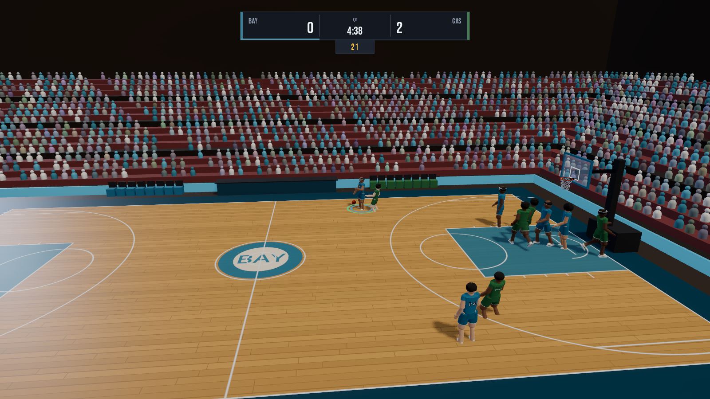

# Retro Hoops

A 3D arcade basketball game built in Godot 4. Full court, five a side, real
shot physics, a 30-team league with a playable season, local and online
two-player. Windows and Android from one source tree.

No art assets are imported. The court, the arena, the crowd and the players are
all generated at runtime from primitives and code, which is why the repository
is a few hundred kilobytes.



## Current state

Playable. A quick-play game runs start to finish with a working clock, shot
clock, rules and box score, and a season can be played or simulated through to
the playoffs. It is not finished — see [Limitations](#limitations) and
[Roadmap](#roadmap).

## Features

**Gameplay**
- [x] Five-a-side and three-a-side on a regulation court (28.65m x 15.24m, 3.05m rim)
- [x] Shooting resolved through real projectile physics, not a dice roll
- [x] Dunks and layups gated on actual reach: standing reach plus vertical against the rim
- [x] Dribbling, passing with lane interception, steals, blocks, rebounds
- [x] Shot clock, period clock, out of bounds, shot-clock violations, overtime
- [x] Fouls, free throws, team fouls and the bonus
- [x] Man-to-man defence with help on drives, off-ball spacing and cuts
- [x] Stamina that decays with sprinting and drags on shooting

**Modes**
- [x] Quick play with team, arena, period length and opponent selection
- [x] Season: 30 teams, two conferences, 58-game double round robin, standings
- [x] Other league games simulated so the table moves while you play
- [x] Local two player on one screen (keyboard plus pad, or two pads)
- [x] Online two player, host authoritative, LAN discovery or direct address

**Audio**
- [x] Every sound synthesised at runtime: rim, net, backboard, dribble, whistle, buzzer
- [x] Crowd bed whose level tracks what is happening on the floor

**Presentation**
- [x] Broadcast camera plus behind, high, courtside and baseline angles
- [x] Procedural player models with team kits, numbers, body types and skin tones
- [x] Generated arena: seating bowl, animated crowd, benches, scoreboard, banners
- [x] Drawn-in-code UI on one design system

**Content**
- [x] 30 fictional franchises with generated 12-man rosters
- [x] Roster packs: your own teams and players from a JSON file

## Running it

You need [Godot 4.7](https://godotengine.org/download) (standard build, not
.NET). No other dependencies.

```bash
godot --path game
```

To play a build instead of the editor, download the release, or export one
yourself:

```bash
godot --headless --path game --export-release "Windows Desktop" build/windows/RetroHoops.exe
godot --headless --path game --export-debug "Android" build/android/RetroHoops.apk
```

The Android export needs the Android SDK (build-tools 35, platform 35) and a
JDK 17 or newer configured in Godot's editor settings, plus a debug keystore.

## Controls

| | Keyboard | Gamepad |
|---|---|---|
| Move | WASD | Left stick |
| Sprint | Shift | Right trigger |
| Shoot | Space (hold and release) | A |
| Pass | E | X |
| Special / dunk | Q | B |
| Switch defender | F | Y |
| Pause / back | Esc | Start |

On offence the shoot button charges a meter; release it inside the green window
for the best result. Release timing and the shooter's ratings both feed the
same accuracy number, which moves the aim point — the ball is then left alone,
so a bad shot misses for a reason you can watch.

Player two uses the second connected pad. On phones an on-screen stick and
buttons appear automatically.

## Architecture

```
game/scripts/
  core/     settings, save data, court dimensions, collision layers
  data/     league generation, teams, roster packs, season simulation
  match/    the game itself: pawns, ball, rules, clock, AI, camera
  gfx/      everything drawn in 3D: court, arena, crowd, player rig
  ui/       menus and HUD, all drawn in code
  net/      session, discovery and state replication
  tools/    dev-only: screenshot capture, headless sim, shot lab
```

Three decisions shape the rest:

**Humans, the AI and remote players all fill in the same `PlayerIntent`.** The
pawn never knows who is driving it, so there is one movement and shooting code
path rather than three.

**Shots are honest physics.** Ratings, release timing and how contested the
shooter is produce a single accuracy value. That value offsets the aim point;
the ball is launched there and nothing touches it afterwards. Misses rim out on
their own and can still fall.

**Online is host authoritative.** The host simulates and broadcasts a 24Hz
snapshot. The client uploads intent and interpolates. Both sides watch one game
instead of two that drift.

More detail in [docs/architecture.md](docs/architecture.md).

## Roster packs

The game ships no real players or teams. It reads packs from `user://packs/`
so you can add your own. Format and an example: [docs/player-packs.md](docs/player-packs.md).

## Development tools

```bash
# Run the self tests (2745 checks: league, geometry, shot solver, packs, audio)
godot --headless --path game res://scenes/self_test.tscn

# Play a headless game and print a box score, for balance work
godot --headless --path game res://scenes/match.tscn -- --sim 330

# Check shot physics, then map accuracy to make percentage
godot --headless --path game res://scenes/dev_shot_lab.tscn
godot --headless --path game res://scenes/dev_shot_lab.tscn -- --calibrate

# Save a frame from any scene
godot --path game res://scenes/main_menu.tscn -- --shot out.png --after 3

# Both ends of an online game, headless
godot --headless --path game res://scenes/main_menu.tscn -- --net-host
godot --headless --path game res://scenes/main_menu.tscn -- --net-join 127.0.0.1
```

The sim probe is what the shooting balance was tuned against. A quarter
currently runs around 46% from the field with roughly 16 assists and 7
turnovers between the two teams.

## Limitations

Things that are genuinely not there or not good yet:

- **No foul trouble.** Fouls and the bonus are called, but nobody fouls out
  and there is no offensive foul or charge.
- **No traveling, backcourt or three-second violations.** Only the shot clock
  and out of bounds are called.
- **3-on-3 uses full-court rules.** It is five-a-side with fewer players, not
  half-court make-it-take-it.
- **Online is two players only**, one per side, and has no lag compensation —
  the visitor sees roughly their ping behind the host. It is built for a LAN or
  a good connection.
- **No substitutions or fatigue management.** Starters play the whole game.
- **The AI does not run set plays.** It spaces, cuts, drives and kicks out, but
  there is no playbook.
- **Season is one year.** No offseason, draft, trades or progression.
- **Android is untested on hardware.** The APK builds and signs, and the touch
  controls and mobile renderer are wired up, but nothing has been run on a
  phone yet. Treat it as unverified.

## Roadmap

**Done** — everything in the feature list above.

**Next**
- Fouling out, offensive fouls and charges
- Menu music, and commentary call-outs
- Substitutions and a rotation the AI manages
- Half-court rules for 3-on-3

**Planned**
- Playoffs through to a final, with a champion recorded in league history
- Create-a-player and roster editing in game
- Set plays and defensive schemes
- Multi-season careers with progression and an offseason

## Licence

Code is MIT, see [LICENSE](LICENSE). Bundled fonts (Bebas Neue, Barlow) are
under the SIL Open Font License; their licences are in `game/assets/fonts/`.

All team names, player names and marks in this repository are invented. Nothing
here reproduces a real league, club or person.
